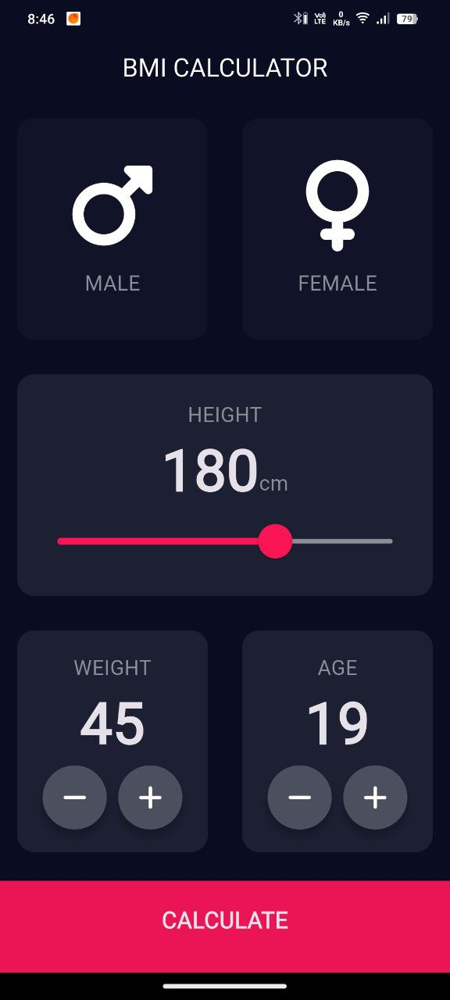
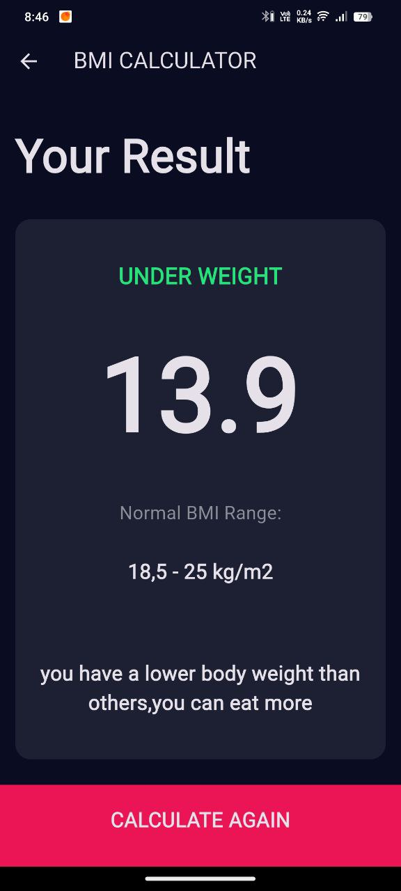

# ⚖️ BMI Calculator

A new Flutter project to calculate Body Mass Index (BMI) with a clean UI.

---

## 📸 App Screenshots

### 📏 BMI Input Screen


### 📊 BMI Result Screen


> 📂 Make sure to place your screenshots inside the `screenshots/` folder at the root of the project.

---

## 🏁 Getting Started

This project is a starting point for a Flutter application.

Helpful resources to get started:

- [Lab: Write your first Flutter app](https://docs.flutter.dev/get-started/codelab)
- [Cookbook: Useful Flutter samples](https://docs.flutter.dev/cookbook)

For comprehensive help, visit the [Flutter Documentation](https://docs.flutter.dev/), which includes tutorials, examples, and API references.

---

## 🛠️ Installation

To set up and run the project locally:

1. **Clone the repository:**
   ```bash
   git clone https://github.com/your-username/bmi.git
2. Navigate to the project directory
   ```bash
   cd bmi
3. Install the required dependencies:
   ```bash
   flutter pub get
4. Run the app:
   ```bash
   flutter run